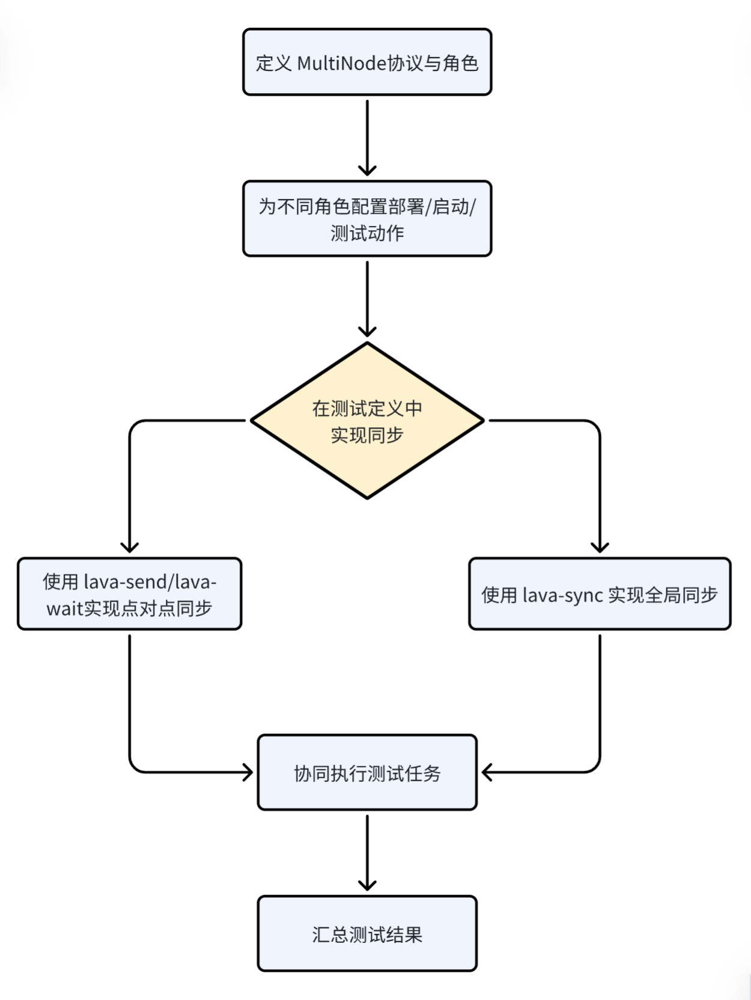

## LAVA MultiNode

### 1. 介绍

LAVA MultiNode的核心是让多台设备（节点）作为一个测试组协同工作，它们通过定义角色（Role）、在任务中指定这些角色，并使用专门的 MultiNode API命令进行同步与通信

### 2. 工作机制



LAVA MultiNode通过几个核心机制来管理多设备测试：

- **角色（Roles）**：测试中每类设备都被赋予一个“角色”，例如 `server`（服务器）和 `client`（客户端）。一个角色可以包含多个同类型的设备
- **设备组（MultiNode Group）**：所有分配到角色的设备会形成一个逻辑上的“组”。只有当所有指定类型的设备都就绪时，测试任务才会开始
- **同步（Synchronization）**：设备间通过 MultiNode API（如 `lava-send` 和 `lava-wait` 命令）进行通信和同步，确保测试步骤按正确顺序执行
- **协调器（Coordinator）**：一个名为 `lava-coordinator` 的独立后台服务负责管理所有MultiNode设备间的消息传递。这是运行MultiNode测试的前提。

### 3. 常用的 MutiNode API 命令

在测试脚本中，常用的命令如下：

| 命令               | 用途                       | 示例                      |
| ------------------ | -------------------------- | ------------------------- |
| lava-send <消息ID> | 向组内发送一条消息         | lava-send server-up       |
| lava-wait <消息ID> | 等待接收特定消息           | lava-wait server-up       |
| lava-sync <标记>   | 让组内所有设备在此步骤同步 | lava-sync point-1         |
| lava-role          | 查看当前设备的角色         | CURRENT_ROLE=$(lava-role) |

#### 3.1 lava-send 与 lava-wait

`lava-send` 与 `lava-wait`：信号与数据传递

这对命令是最常用组合，用于有数据传递需求的同步。

- **`lava-send <signal_name> [key=value ...]`**
  发送一个名为 `<signal_name>` 的信号，并可附加任意键值对数据。
- **`lava-wait <signal_name>`**
  等待名为 `<signal_name>` 的信号。收到的数据会自动写入 `/tmp/lava_multi_node_cache.txt` 文件，文件里每行一个键值对。

在 server 设备上

````
#!/bin/bash

MY_IP=$(ip -4 addr show eth0 | grep -oP '(?<=inet\s)\d+(\.\d+){3}')
lava-send server-ready ip=${MY_IP} port=8080               # 发送“server-ready”信号，并携带IP信息
echo "Server has notified clients."
````

在 client 设备上

````
#!/bin/bash

lava-wait server-ready           # 等待server发出的信号
source /tmp/lava_multi_node_cache.txt         # 从缓存文件中提取数据
echo "Server IP is: $ip, Port is: $port"
````

#### 3.2 lava-sync

`lava-sync`：简单同步点

当只需同步进度，无需传递额外数据时，使用此命令更简洁。

- **`lava-sync <sync_point_name>`**

  所有设备执行到此处都会暂停，直到组内所有角色的设备都执行到同一个同步点，才会继续向下执行。

在所有角色的设备上执行相同的脚本

````
#!/bin/bash

# 第一阶段：各自安装依赖包
yum install -y some-package

# 同步点：等待所有设备安装完成
lava-sync packages-installed

# 第二阶段：安装完成后，同时开始下一步操作
run-next-phase-test
````

#### 3.3 lava-role

`lava-role`：角色识别

用于在编写通用测试脚本时，让设备知道自己该做什么。

根据角色执行不同操作

````
#!/bin/bash
CURRENT_ROLE=$(lava-role)

case "${CURRENT_ROLE}" in
    "server")
        echo "I am the server. Starting daemon..."
        start-server-process
        ;;
    "client")
        echo "I am a client. Waiting and then probing..."
        lava-wait server-up
        run-client-probe
        ;;
    *)
        echo "Unknown role: ${CURRENT_ROLE}"
        exit 1
        ;;
esac
````

需要注意：

- **命名唯一性**：`lava-send` 和 `lava-sync` 使用的信号名、同步点名在同一个测试任务中应保持唯一，避免混淆。

- **理解作用域**：`lava-wait` 默认会等待组内任何其他设备发出的对应信号。如果需要更精细的控制，需结合角色逻辑设计。

- **数据量限制**：API 设计用于传递控制信号和小数据（如 IP、状态码）。传输大文件需在测试中自行建立网络连接（如 HTTP、SCP）。

- **查看日志**：所有 API 的调用和接收事件都会自动记录在 LAVA 测试结果中，是调试同步问题的主要依据。

### 4. 编写 MultiNode job

- 移除 device_type 声明，该声明仅适用于单个设备
- 添加 MultiNode protocol 配置，告诉 LAVA 如何选择多个设备进行测试
- 在 `deploy`、`boot`、`test` 等动作中，通过 `role` 字段指定其适用的角色
- 在测试定义的 `run` 步骤中，使用MultiNode API命令

#### 4.1 定义 MultiNode roles

MultiNode protocol 定义了 roles（角色） 这一新概念，可以使用任意描述性名称来命名测试中的不同角色，只要他们是唯一的即可。

````
protocols:
  lava-multinode:
    roles:
      server:  # 角色名
        device_type: lpi4a   # 该角色需要的设备类型
        count: 1        # 该角色需要多少设备
      client:
        device_type: lpi4a
        count: 1
    timeout:
      minutes: 10      # 整个多节点测试的最大执行时间限制，表示从测试开始执行到必须结束的最大时间为10分钟
````

此处定义的角色名称稍后将在测试作业中使用，以确定哪些测试在哪些设备上运行

#### 4.2 使用 MultiNode roles

actions 定义中的每个操作都应该包含角色字段以及一个或多个标签，以匹配已定义的角色。

````
actions:
- deploy:
    role:
      - server
      - client
    timeout:
      minutes: 120
    to: tftp
    dtb:
      url: http://10.211.102.58/kernel-build-results/rvck-olk_pr_79/dtb/th1520-lichee-pi-4a.dtb
    kernel:
      url: http://10.211.102.58/kernel-build-results/rvck-olk_pr_79/Image
      type: image
    nfsrootfs:
      url: https://fast-mirror.isrc.ac.cn/openeuler-sig-riscv/openEuler-RISC-V/RVCK/openEuler24.03-LTS-SP1/openeuler-rootfs.tar.gz
      compression: gz
- boot:
    role:
      - server
      - client
    timeout:
      minutes: 20
    method: u-boot
    commands: nfs
    soft_reboot:
    - root
    - openEuler
    - reboot
    - The system will reboot now!
    prompts: ["root@openeuler-riscv64", "login:", "Password:"]
    auto_login:
      login_prompt: "(.*)openeuler-riscv64 login:(.*)"
      username: root
      password_prompt: "Password:"
      password: openEuler12#$
````

`run` 步骤中，使用 MultiNode API 命令

````
- test:
    role:
      - server
    timeout:
      minutes: 10109
    definitions:
      - repository: https://github.com/RVCK-Project/lavaci.git
        from: git
        name: iperf-server-test
        path: lava-testcases/performance-test/iperf/iperf-server.yaml
        parameters:
          PORT: "5201"

- test:
    role:
      - client
    timeout:
      minutes: 10109
    definitions:
      - repository: https://github.com/RVCK-Project/lavaci.git
        from: git
        name: iperf-client-test
        path: lava-testcases/performance-test/iperf/iperf-client.yaml
        parameters:
          TIME: "10"
          THREADS: "1"
          AFFINITY: ""
````

不建议将 lava-test-case 命令与 MultiNode API 调用结合使用。首先，lava-test-case 会忽略 API 调用中可能出现的任何错误，而 lava-test-shell 会将其视为成功。其次，这样会导致每个 API 调用生成重复的测试用例（一个来自 lava-test-case，另一个来自 API 命令）。


参考：

https://validation.linaro.org/static/docs/v2/multinode.html

https://validation.linaro.org/static/docs/v2/multinodeapi.html

https://validation.linaro.org/static/docs/v2/writing-multinode.html

