## LAVA User Manual

### 1. LAVA 简介

LAVA是由 linaro 开发的一种开源自动化测试框架，主要用于测试linux内核的系统部署，可以用于执行 kernel 和硬件测试。

### 2. 使用方法

#### 2.1 提交 LAVA job

输入 https://lava.oerv.ac.cn/ 进入 LAVA，选择 Scheduler -> Jobs 可以进入 LAVA job list 界面，可以查看各个测试任务的状态

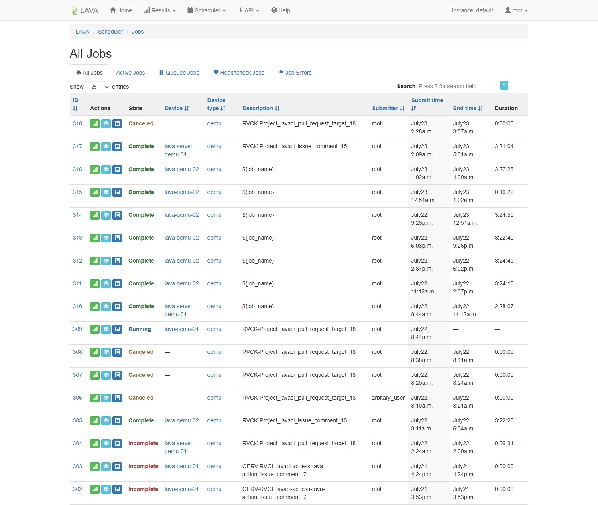

点击右上方 Sign In，输入账号登录，选择 Scheduler -> Submit，输入 job 内容，先点击 Validate 校验一下有没有语法错误，如果有语法错，会有相关提示，如果语法正确，点击 Submit 提交该 job

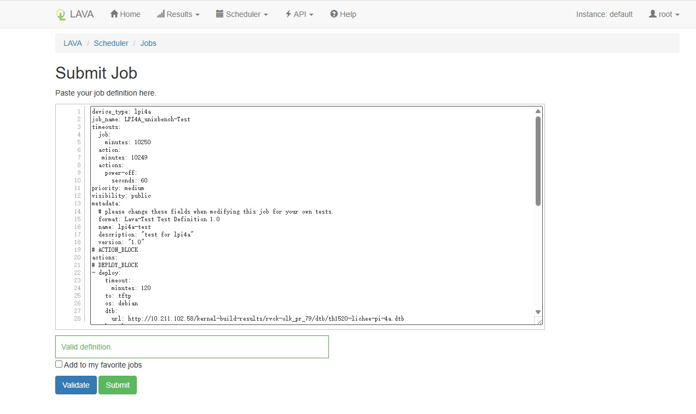

#### 2.2 查看测试日志和结果

在 lava job list 界面，选择要查看的 job，该 job 前面有 3 个图标，从左到右分别是查看测试结果，查看日志，查看 job 定义

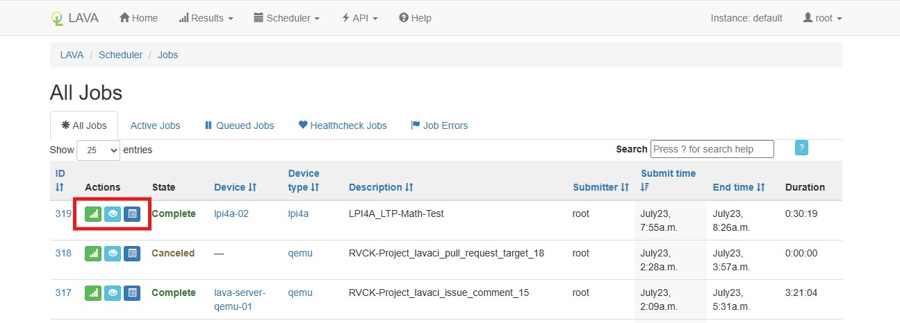

当日志过大，在日志界面无法通过 web 查看日志，只能下载到本地查看

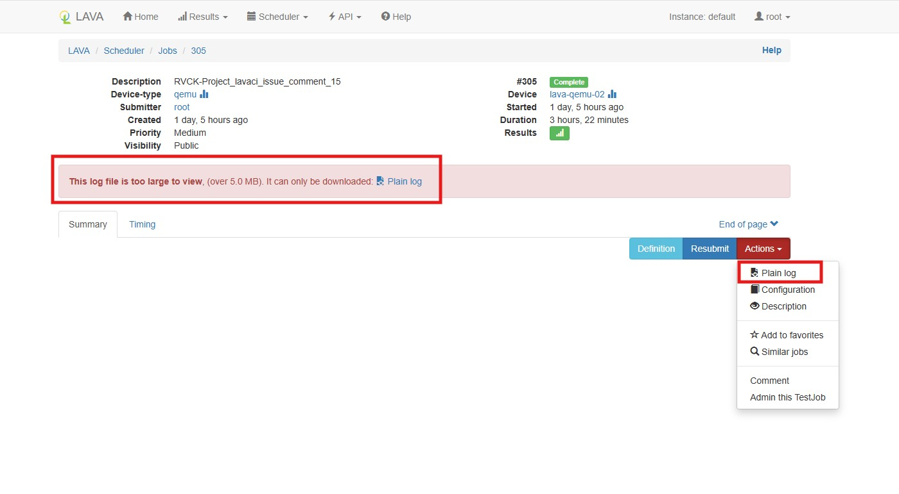

点击上方菜单中的 Results -> Results，进入 lava results overview 界面

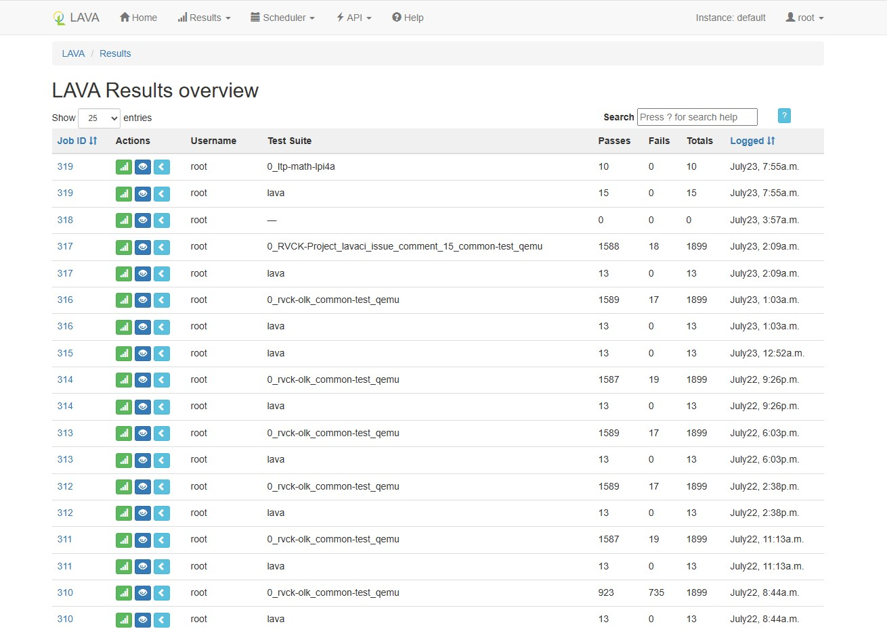

每个 job id 对应多个结果，包括 lava job 中每个阶段执行结果，以及测试用例执行结果，下图是测试用例执行结果

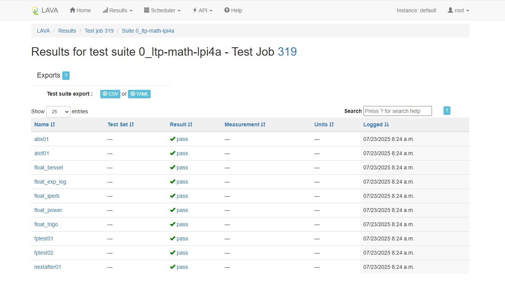

#### 2.3 查看设备类型和设备

Scheduler -> Device Types，可以看到目前 LAVA 平台支持的设备类型，以及各个设备类型下面设备的状态

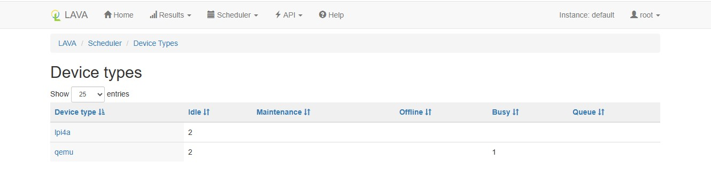

从上图可以看出，lpi4a 有 2 个设备，都是 idle 状态，qemu 有 3 个设备，2个 idle 状态，1个 busy 状态，也就是正在执行 job

Scheduler -> Devices，可以看到目前 LAVA 平台中所有设备的信息

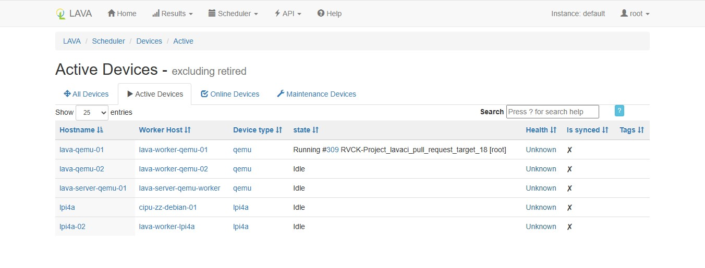

### 3. LAVA job 和 LAVA 测试用例语法

#### 3.1 LAVA job

LAVA job 是一个 yaml 文件，内容如下所示

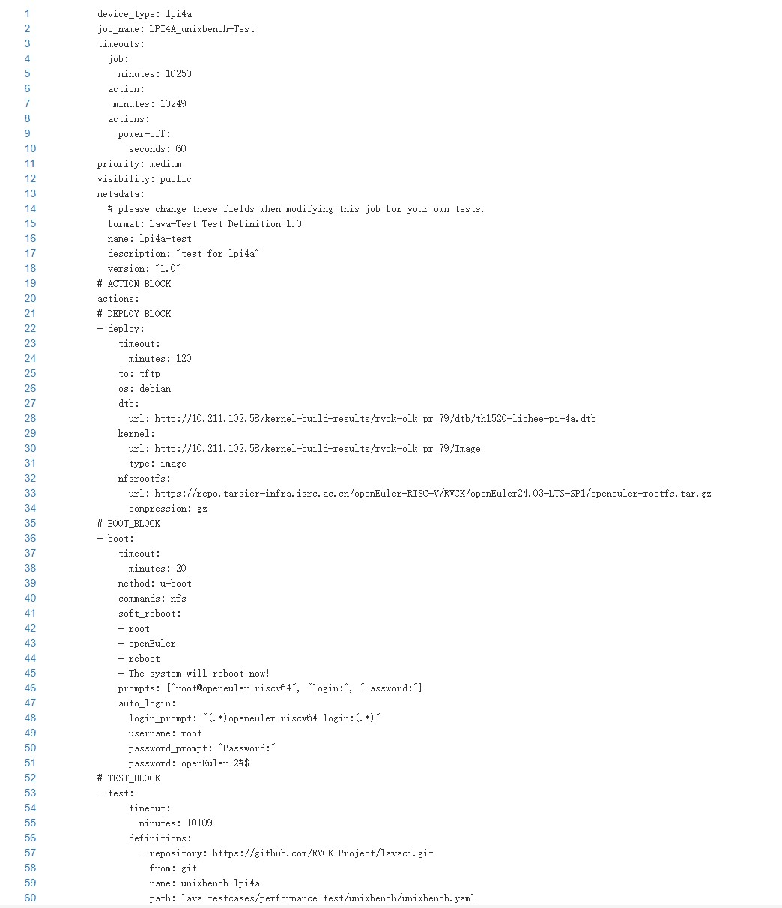

其中各个字段的解释如下：

device_type：定义执行该测试任务的设备类型，这个设备类型要与LAVA设备类型界面列出的内容相匹配

job name：自定义测试任务名称

context：用来客制化设备类型文件中的配置，不是必选内容，如果不需要修改设备类型文件，这项可以不要

timeout：定义测试任务各个部分花费时长，因为 LAVA 测试任务执行中可能会出现一些问题，允许 LAVA 挂起失败的测试任务，将执行测试的设备 release 出来，调度给下一个测试任务

priority：支持0~100之间的整数，也支持 high(100)，medium(50)，low(0)，服务器的调度程序在测试任务进入队列排序时会根据优先级来安排接下来运行哪个测试任务

Visibility：控制谁可以查看测试任务内容和执行结果，支持 public，personal，group

actions：操作列表，包括 deploy，boot 和 test

deploy：指定下载启动设备所需要的文件，例如 kernel 镜像，文件系统镜像，dtb 文件等

boot：定义启动设备的方法和提示，登录界面的提示符，登录系统的用户名和密码

test：指定要执行的测试用例，测试用例可以直接在里面定义，也可以从某一个 git 仓库获取

[lavaci 仓库](https://github.com/RVCK-Project/lavaci/tree/main/lava-job-template)存储了一些 LAVA job 模板，供参考

#### 3.2 LAVA 测试用例

 LAVA 测试用例的格式也是 yaml 文件，可以将测试用例存储在 git 仓库中，在测试任务中下载调用，或者直接将测试用例内容写在测试任务中，直接写在测试任务中的测试用例叫做inline测试用例，为了方便测试用例管理和复用，建议将测试用例存储在git 仓库中

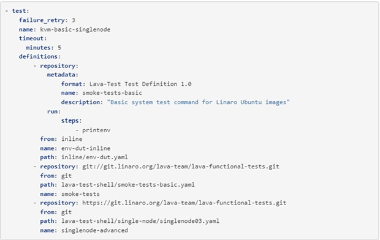

上图显示的是测试任务中test字段的内容，在这个测试任务中，执行了3个测试用例，

第一个是 inline 测试用例，执行 printenv 命令，另外2个测试用例都是 git 仓库里的，通过 git clone 下载后再执行

repository：表示获取测试用例的仓库，inline 测试用例这个字段里的内容就是测试用例内容

from：表示使用用例方式，inline 和git 分别对应 inline 测试用例和存储在 git 仓库的测试用例

path：表示测试用例在git仓库里的完整路径，对于inline测试用例，这个路径就是自定义一个测试用例文件名称，放在 inline 目录下

name：表示执行此测试时使用的名称，对应LAVA results overview 界面 test suite 名称

测试用例由 metadata，params，run 三部分字段内容组成

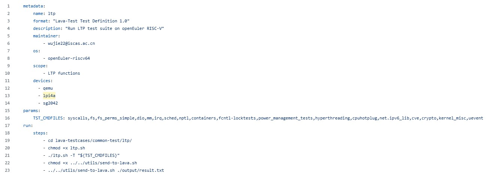

metadata字段包括：

| 字段名称    | 解释                         | 必选 or 可选 |
| ----------- | ---------------------------- | ------------ |
| format      | LAVA 识别的格式字符串        | 必选         |
| name        | 自定义的测试用例名称         | 必选         |
| description | 测试用例的描述               | 必选         |
| maintainer  | 测试用例维护者的电子邮件地址 | 可选         |
| scope       | 测试用例支持的操作系统列表   | 可选         |
| os          | 测试用例的测试范围           | 可选         |
| devices     | 可以运行该测试用例的设备列表 | 可选         |

params 字段是可选字段，用来定义测试中用到的参数，如果测试中无需传入参数，则该字段可以省略

run 字段用来定义在设备上测试的运行步骤和命令，一般情况下，建议把需要执行的测试步骤编写成一个shell脚本，在改字段中直接调用即可，例如将 unixbench 测试写成 shell 脚本 unixbench.sh，然后在测试用例 unixbench.yaml 中调用

unixbench.sh

````
metadata:
  name: unixbench
  format: "Lava-Test Test Definition 1.0"
  description: "Run unixbench on RISC-V device"
  maintainer:
    - wujie22@iscas.ac.cn
  os:
    - openEuler-riscv64
  scope:
      - performance
  devices:
    - qemu
    - lpi4a
    - sg2042
run:
  steps:
    - cd lava-testcases/performance-test/unixbench
    - bash unixbench.sh
    - chmod +x ../../utils/send-to-lava.sh
    - ../../utils/send-to-lava.sh ./output/result.txt
````

unixbench.yaml

````
metadata:
  name: unixbench
  format: "Lava-Test Test Definition 1.0"
  description: "Run unixbench on RISC-V device"
  maintainer:
    - wujie22@iscas.ac.cn
  os:
    - openEuler-riscv64
  scope:
      - performance
  devices:
    - qemu
    - lpi4a
    - sg2042
run:
  steps:
    - cd lava-testcases/performance-test/unixbench
    - bash unixbench.sh
    - chmod +x ../../utils/send-to-lava.sh
    - ../../utils/send-to-lava.sh ./output/result.txt
````

LAVA 中使用 lava test case 命令可以将测试结果显示在 Results 界面：

````
lava-test-case $TEST_CASE_NAME --result $RESULT
lava-test-case $TEST_CASE_NAME --result $RESULT --measurement $MEASUREMENT --units $UNITS
````

上图中的脚本 send-to-lava.sh 是用来读取存储测试结果的文件，并将测试结果用 lava-test-case 命令反馈给 LAVA

详细的 LAVA job 和 测试用例语法可以参看 [LAVA 官网](https://validation.linaro.org/static/docs/v2/index.html)，[lavaci 仓库](https://github.com/RVCK-Project/lavaci/tree/main/lava-testcases)里已有一些测试用例，可供参考并直接在 LAVA 平台使用
